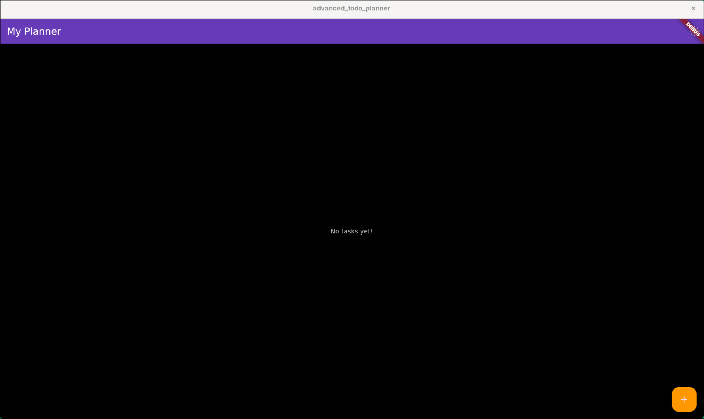
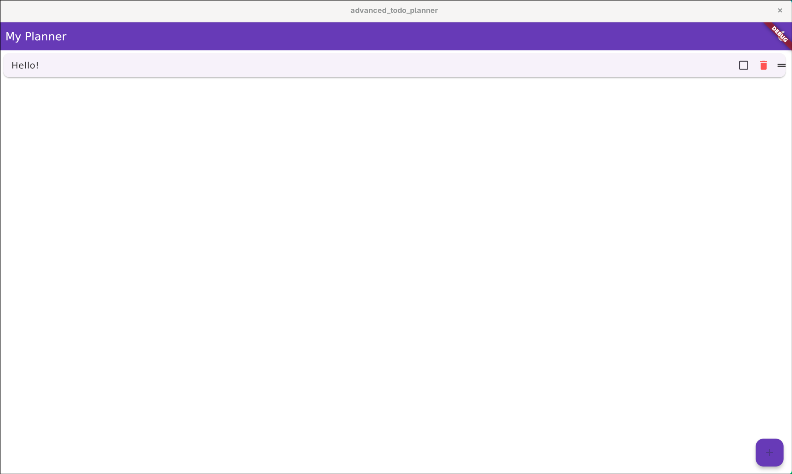
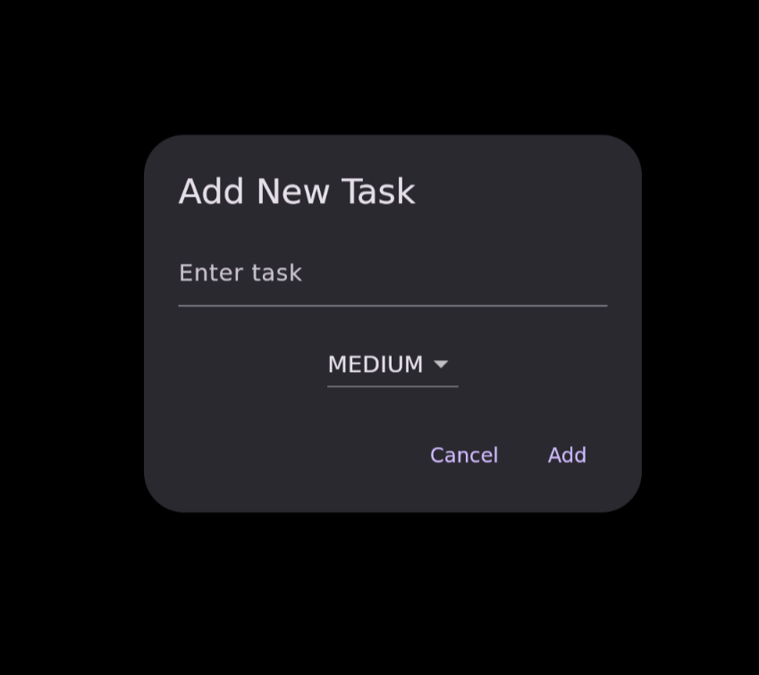
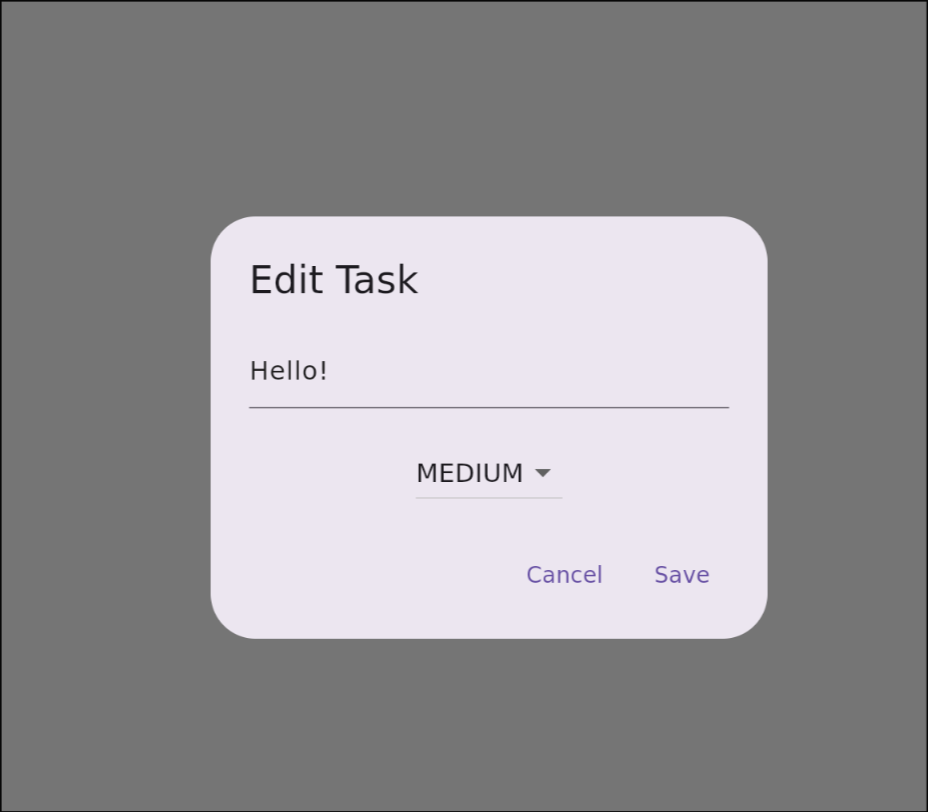
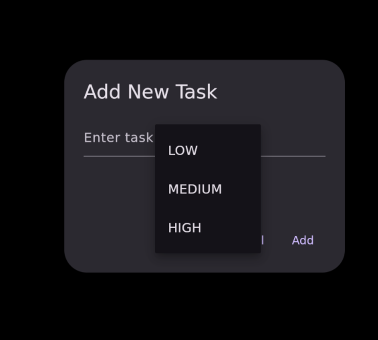

# Advanced Todo Planner

A simple yet powerful Flutter-based to-do list app that helps you manage tasks efficiently.
Add, complete, and delete tasks easily, with intuitive UI and smooth interactions.

🔍 **Status**: Archived as of June 2025 — this project served as a personal practice app to explore Flutter, Dart, state management, and local persistence using Hive.

---

## Features

* Add new tasks via a dialog with quick entry (press Enter to add)
* Mark tasks as completed with a checkbox — completed tasks get crossed out
* Delete tasks individually with a dedicated delete button
* Dynamic task list that updates in real-time
* Clean and minimal UI using Flutter’s Material Design components
* Auto-remove tasks after 24 hours or on day change
* Reorder tasks to push completed ones to the bottom (original order preserved)
* Dark mode support

---

## Screenshots







---

## Getting Started

### Prerequisites

* [Flutter SDK](https://flutter.dev/docs/get-started/install) (version 3.0 or higher recommended)
* A code editor like [VS Code](https://code.visualstudio.com/) or [Android Studio](https://developer.android.com/studio)
* (Personally built using **NeoVim**)

### Installation

1. Clone this repository:

   ```bash
   git clone https://github.com/yourusername/advanced_todo_planner.git
   cd advanced_todo_planner
   ```

2. Get the Flutter packages:

   ```bash
   flutter pub get
   ```

3. Run the app:

   ```bash
   flutter run
   ```

---

## Usage

* Tap the `+` floating action button to add a new task.
* Type your task in the dialog and press **Enter** or tap **Add**.
* Check the checkbox to mark a task as completed (it will be crossed out).
* Tap the trash icon to delete a task.

---

## Contributing

Feel free to open issues or submit pull requests.
Please follow the code style and add tests where applicable.

---

## License

This project is licensed under the MIT License — see the [LICENSE](LICENSE) file for details.

---

## Contact

**Created by:** Vinayak Tyagi
📧 Email: [vinayaktaygi.ed@gmail.com](mailto:vinayaktaygi.ed@gmail.com)
🐙 GitHub: [vinayaktyagi10](https://github.com/vinayaktyagi10)
